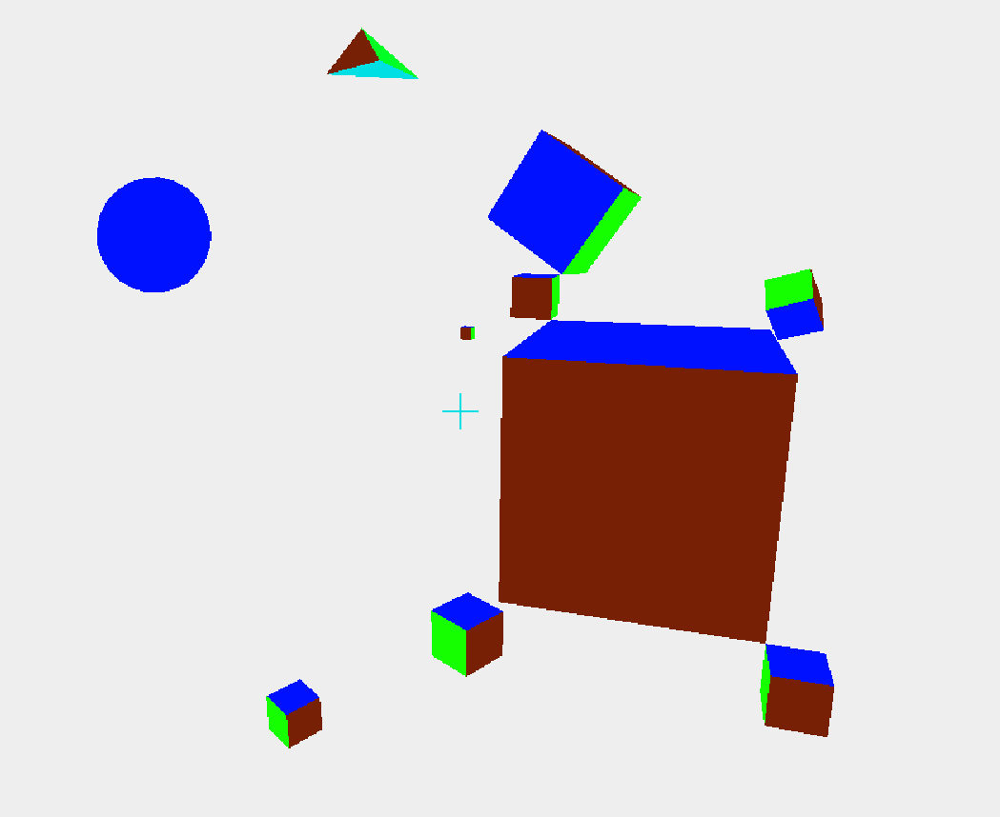

@author Andrew Pareles

Your perspective in this program is through the aperture of a pinhole camera! All 3D objects are represented by their vertices, which are traced "through the pinhole" onto your 2d screen. Since straight edges in 3D will always be seen as straight lines, all non-intersecting faces can be filled in by polygons using solely the information about these traced vertices and their distance to the camera -- ray tracing, ray marching, etc not needed. 

To execute, run the executable file located at ./out/artifacts/3DTest_jar/3DTest.jar

Controls:
- WASD to move
- QE to move up or down
- move mouse to move the camera
- scroll in/out to move directly towards/away from center of view
- Esc for options/pause (for now just hold Esc to freely move mouse)

Ultimately, I'd like to transfer this project to HTML5 and JS...
